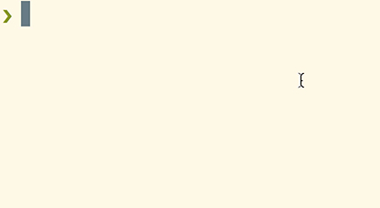

# npm-downloads [](https://semaphoreci.com/rafaelrinaldi/npm-downloads)

> Get the downloads count from a given npm package from the Terminal



## Install

```sh
$ npm install @rafaelrinaldi/npm-downloads -g
```

## Usage

```sh
Usage: npm-downloads <MODULE> [OPTIONS]

  Get the downloads count from a given npm package from the Terminal

Example:
  $ npm-downloads jquery

Options:
  -v --version              Display current software version
  -h --help                 Display help and usage details
     --module               Module to search for the downloads count (or you can just pass it along as seen on the example)
```

## License

MIT :copyright: [Rafael Rinaldi](http://rinaldi.io)
